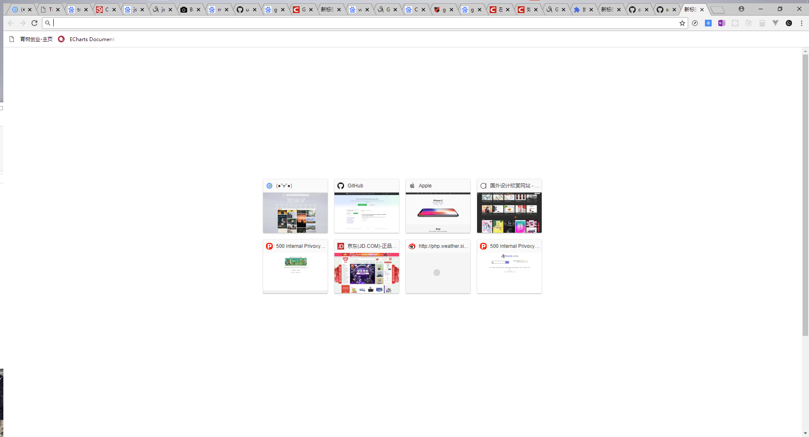
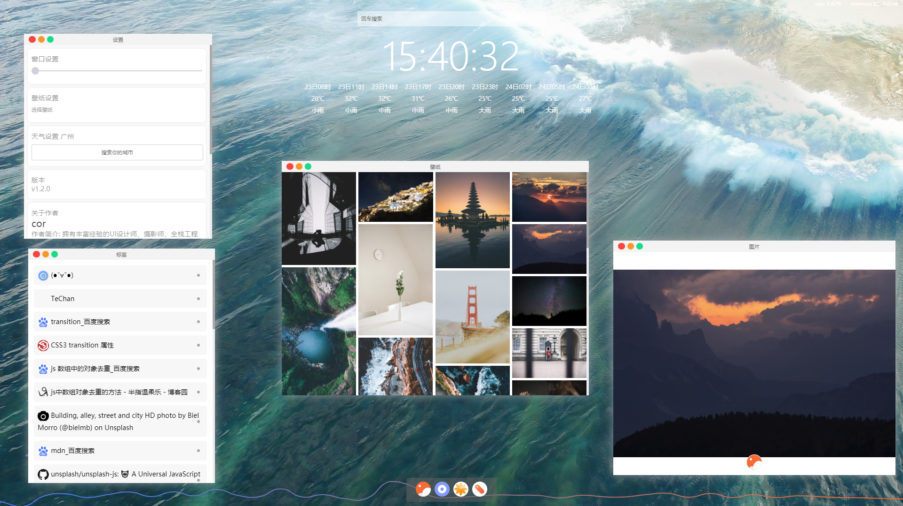
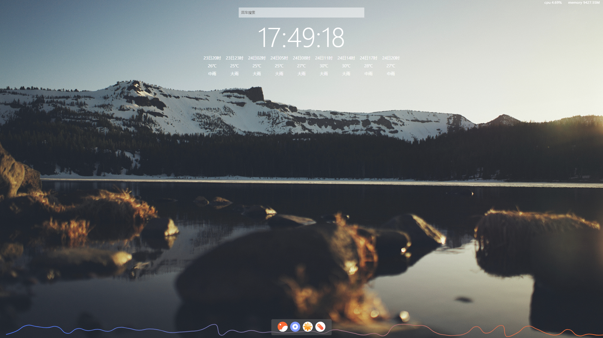
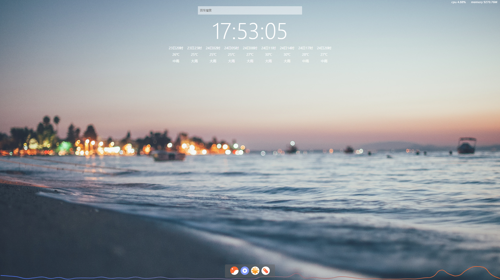
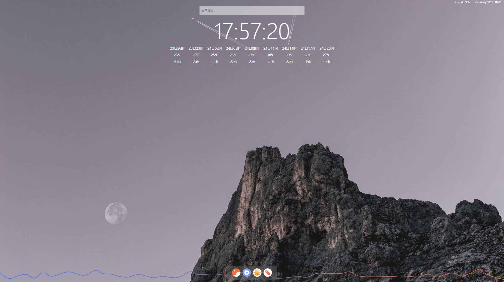
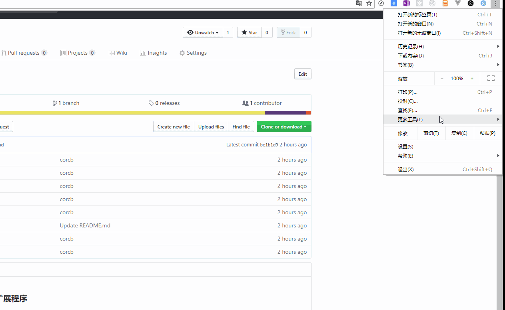

### 这是一个chrome扩展程序 corcb
由于 chrome 的第一个标签页太丑了 
如下

### 真的特别丑
那么作为一只前端狗 

### 颜值即正义 ！！！

所以用react写了这个东西(这是我第一个react项目)
这个东西长这样的 

### 多图预警！！！

嗯 这个看起来有点像mac？肯定要模仿一下apple才能维持一下生活这样子啦

这是一个模拟桌面的扩展程序

## 使用教程

### 1- 使用之前 首先设置 chrome

    设置->自定义字体->最小字号
    拉到最小
### 2- 下载地址 https://github.com/1057376155/corcb/blob/master/build.rar
### 3- 解压
### 4- 安装
记得要打开开发者模式哦！

选择解压的文件 进行程序安装

### 提示
使用npm start 是跑不起来的
要到corcb\src\config\chromeOp.js 中解开注释的那段才可以跑起来
但是要打包的化要把chrome 注释掉

程序的入口在\corcb\src\config\procedure.js

程序的全名为corcb = cor chrome background 

    v1.2.0

    集成壁纸应用 可以用来替换corcb的背景 也可以使用自定义壁纸

    集成天气 可以在设置里面设定地区的天气 

    集成程序本地状态 redux本地化 (即记录程序的位置,在不同的标签内同步程序的位置，但不同步程序的内容)

    集成cpu使用率 内存使用量 可视化cpu波动图

    集成百度搜索 

    集成时间 

    集成标签管理器 (在打开多个标签的时候，chrome的标签会全部挤在一起，十分恶心，所以写了这个程序，可以删除标签或者跳转到标签)

